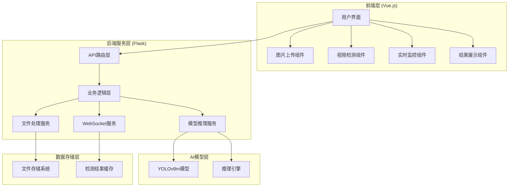

# 基于YOLOv8的室内火灾检测系统开发流程文档

## 项目概述

### 项目背景
本项目旨在构建一个基于YOLOv8m模型的室内火灾检测识别系统，采用Vue.js前端框架和Flask后端框架，实现对室内摄像头图像/视频中火焰或烟雾等火灾迹象的自动识别与报警。

### 技术栈选型
- **前端**: Vue 3 + Vite + Element Plus + Pinia
- **后端**: Flask + Flask-SocketIO + Flask-CORS
- **AI模型**: Ultralytics YOLOv8m
- **开发环境**: Windows
- **实时通信**: WebSocket
- **图像处理**: OpenCV

### 项目目标
1. 实现图片、视频、实时视频流的火灾检测功能
2. 提供友好的Web界面进行检测操作和结果展示
3. 支持实时监控和告警功能
4. 确保系统稳定性和检测准确性

---

## 项目架构设计

### 系统总体架构



### 核心功能模块

#### 1. 图片检测模块
- 单张/批量图片上传
- 火焰/烟雾检测识别
- 检测结果可视化展示
- 检测历史记录管理

#### 2. 视频检测模块
- 视频文件上传处理
- 逐帧分析检测
- 检测进度实时跟踪
- 结果视频生成导出

#### 3. 实时监控模块
- 摄像头实时视频流
- 实时检测与分析
- 火灾告警提示
- 语音告警功能

#### 4. 系统管理模块
- 检测参数配置
- 系统状态监控
- 检测历史查询
- 用户操作日志

---

## 前后端开发步骤

### 第一阶段：项目基础搭建 (第1-2周)

#### 步骤1：项目初始化
**目标**: 创建项目基础结构和开发环境

**具体操作**:
1. 创建项目根目录结构
```
fire-detection-system/
├── frontend/          # Vue.js前端项目
├── backend/           # Flask后端项目
├── models/            # AI模型文件
├── docs/              # 项目文档
├── tests/             # 测试文件
└── README.md          # 项目说明
```

2. 初始化Git仓库
```bash
git init
git add .
git commit -m "Initial project setup"
```

3. 创建开发环境配置
- 前端: `.env.development`
- 后端: `.env` 和 `config.py`

**交付物**:
- 项目目录结构
- Git仓库初始化
- 环境配置文件
- README.md文档

**验收标准**:
- [ ] 项目结构清晰规范
- [ ] Git版本控制正常
- [ ] 环境配置正确

---

#### 步骤2：后端基础框架搭建
**目标**: 建立Flask后端服务基础架构

**具体操作**:
1. 安装Flask及相关依赖
```bash
pip install flask flask-cors flask-socketio flask-restful
pip install ultralytics opencv-python pillow numpy
```

2. 创建Flask应用结构
```python
# app.py - 主应用文件
from flask import Flask
from flask_cors import CORS
from flask_socketio import SocketIO

app = Flask(__name__)
CORS(app)
socketio = SocketIO(app, cors_allowed_origins="*")

# 注册蓝图
from blueprints.detection import detection_bp
from blueprints.monitor import monitor_bp

app.register_blueprint(detection_bp, url_prefix='/api')
app.register_blueprint(monitor_bp, url_prefix='/api')
```

3. 创建项目结构
```
backend/
├── app.py                 # 主应用文件
├── config.py              # 配置文件
├── requirements.txt       # 依赖列表
├── blueprints/            # API蓝图
│   ├── detection.py       # 检测相关API
│   └── monitor.py         # 监控相关API
├── services/              # 业务服务层
│   ├── model_service.py   # 模型服务
│   ├── file_service.py    # 文件服务
│   └── websocket_service.py # WebSocket服务
├── utils/                 # 工具函数
│   ├── image_utils.py     # 图像处理工具
│   └── file_utils.py      # 文件处理工具
└── static/                # 静态文件存储
    ├── uploads/           # 上传文件
    └── results/           # 检测结果
```

**交付物**:
- Flask应用主文件
- API蓝图结构
- 配置管理模块
- 依赖管理文件

**验收标准**:
- [ ] Flask服务可正常启动
- [ ] 跨域配置生效
- [ ] API蓝图注册成功
- [ ] 日志系统正常工作

---

*注：本文档内容较长，完整版本请参考项目仓库中的完整文档。*